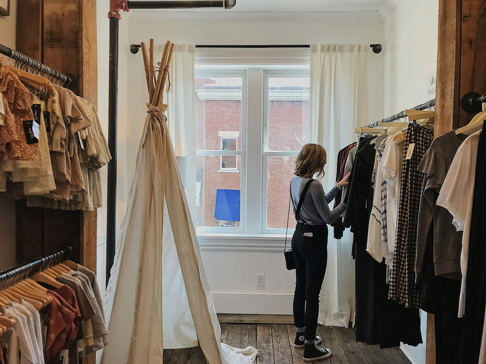

---

layout: ../../../src/layouts/Layouts.astro
title: 'Clothes & E-commerce'
pubDate: 05-04-2024
description: "This is my first Post Blog to my Astro Blog"
author: "Chris 04"
image:
  url: "../../../src/assets/img/web/web_1.jpg"
  alt: "The Astro logo with the word One."
tags: ["Business", "E-commerce", "Fashion"]
paragraph1: "E-commerce clothing has revolutionized the way we shop for clothes, offering a convenient, accessible, and diverse shopping experience. This note will explore the key aspects of this booming sector, from its advantages and challenges to the trends that are shaping it."
paragraph2: "Convenience:Shopping for clothes from the comfort of home, without time or location constraints, is one of the main advantages of e-commerce."

---

## Clothes & E-commerce

Hello E-commerce

===============

E-commerce clothing has revolutionized the way we shop for clothes, offering a convenient, accessible, and diverse shopping experience. This note will explore the key aspects of this booming sector, from its advantages and challenges to the trends that are shaping it.

### Advantages of e-commerce clothing

Convenience:Shopping for clothes from the comfort of home, without time or location constraints, is one of the main advantages of e-commerce.

